<p align="center">
  <picture>
    <source media="(prefers-color-scheme: dark)" srcset="assets/lattice-dark.png">
    <source media="(prefers-color-scheme: light)" srcset="assets/lattice-light.png">
    
  </picture>
</p>
<h1 align="center">Lattice</h1>
<p align="center">
  <em>Graph-Augmented RAG for Code Intelligence</em>
</p>
<p align="center">
  Build a knowledge graph of your codebase. Ask questions in natural language.<br>
  Get answers grounded in both code structure and semantics.
</p>
<p align="center">
  <a href="#quick-start"><strong>Quick Start</strong></a> ·
  <a href="#features"><strong>Features</strong></a> ·
  <a href="#how-it-works"><strong>How It Works</strong></a> ·
  <a href="#status--roadmap"><strong>Roadmap</strong></a>
</p>

---

Lattice is a **hybrid retrieval system** that combines the precision of knowledge graphs with the flexibility of semantic search. Unlike traditional code search that finds files containing keywords, or semantic search that finds similar-looking code, Lattice understands how your code actually connects—the call chains, inheritance hierarchies, and module dependencies that define real software architecture.

<p align="center">
  <picture>
    <source media="(prefers-color-scheme: dark)" srcset="assets/diagrams/hero-hybrid-search-dark.png">
    <source media="(prefers-color-scheme: light)" srcset="assets/diagrams/hero-hybrid-search-light.png">
    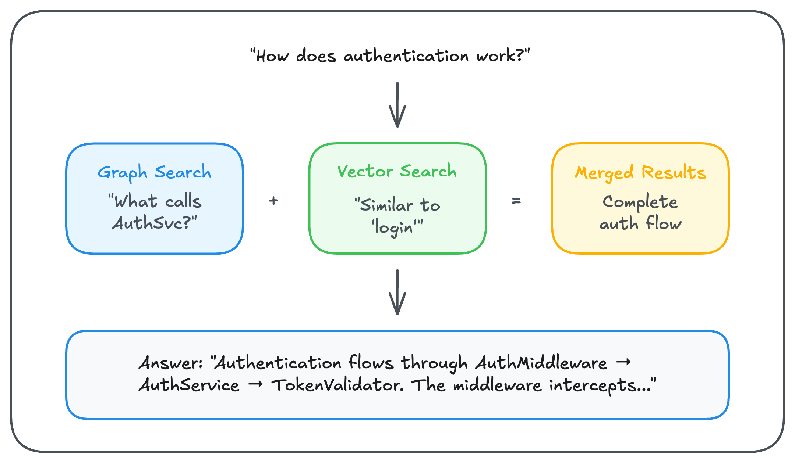
  </picture>
</p>

---

## Table of Contents

-   [Why Lattice?](#why-lattice)
-   [Supercharging AI Coding Assistants](#supercharging-ai-coding-assistants)
-   [How It Works](#how-it-works)
    -   [The Indexing Pipeline](#the-indexing-pipeline)
    -   [The Query Pipeline](#the-query-pipeline)
    -   [Hybrid Ranking](#hybrid-ranking)
    -   [Multi-Hop Graph Reasoning](#multi-hop-graph-reasoning)
-   [Features](#features)
    -   [Structural Code Understanding](#structural-code-understanding)
    -   [Documentation Intelligence](#documentation-intelligence)
    -   [Multi-Project Support](#multi-project-support)
    -   [MCP Integration](#mcp-integration)
-   [Quick Start](#quick-start)
-   [CLI Reference](#cli-reference)
-   [Technology Stack](#technology-stack)
-   [Status & Roadmap](#status--roadmap)

---

## Why Lattice?

Modern codebases are complex graphs of interconnected components. When you ask "How does payment processing work?", the answer isn't in a single file—it's spread across API handlers, service classes, validation logic, database operations, and error handlers, all connected through function calls and inheritance relationships.

Traditional search approaches each solve part of this problem:

| Approach            | Strengths                                     | Limitations                                      |
| ------------------- | --------------------------------------------- | ------------------------------------------------ |
| **Keyword Search**  | Fast, exact matches                           | Misses synonyms, can't follow relationships      |
| **Semantic Search** | Understands meaning, finds similar code       | No structural awareness, can't trace call chains |
| **Graph Traversal** | Maps exact relationships, traces dependencies | Requires knowing what to look for                |

Lattice combines all three. When you query "What functions validate user input?", Lattice:

1. **Searches the knowledge graph** for entities with "validate" in their name or relationships
2. **Searches vector embeddings** for code semantically similar to "input validation"
3. **Fuses results** using a hybrid ranking algorithm that rewards code appearing in both searches
4. **Expands context** by traversing the graph to find callers, callees, and related classes
5. **Synthesizes an answer** grounded in actual code paths with source citations

This approach is inspired by [Microsoft's GraphRAG research](https://www.microsoft.com/en-us/research/project/graphrag/), which demonstrated that combining knowledge graphs with retrieval-augmented generation produces more comprehensive, grounded answers than either technique alone. The [original paper](https://arxiv.org/abs/2404.16130) showed particular improvements for questions requiring synthesis across multiple sources—exactly the kind of questions developers ask about codebases.

---

## Supercharging AI Coding Assistants

AI coding assistants like [Claude Code](https://claude.com/claude-code), [Gemini CLI](https://github.com/google-gemini/gemini-cli), and [OpenAI Codex](https://openai.com/index/introducing-codex/) are powerful—but they face fundamental challenges when working with large codebases. Lattice solves these problems by serving as a **persistent knowledge layer** that any AI assistant can query via MCP.

### The Problem with On-Demand Exploration

When you ask an AI assistant "How does authentication work?", it typically:

1. Reads the directory structure to understand the project layout
2. Searches for files containing "auth" or similar keywords
3. Reads those files one by one to understand the code
4. Searches for related files (imports, callers, etc.)
5. Reads more files to build context
6. Finally synthesizes an answer

This exploration loop is **expensive**:

<p align="center">
  <picture>
    <source media="(prefers-color-scheme: dark)" srcset="assets/diagrams/context-window-dark.png">
    <source media="(prefers-color-scheme: light)" srcset="assets/diagrams/context-window-light.png">
    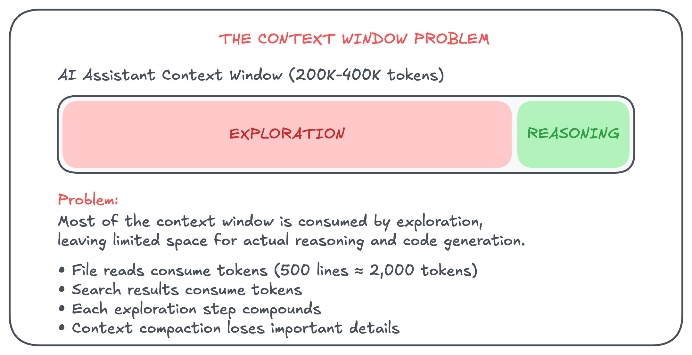
  </picture>
</p>

As [noted in Gemini CLI's feature requests](https://github.com/google-gemini/gemini-cli/issues/2065), codebases can quickly exceed the context window's capacity, leading to incomplete understanding. [Claude Code auto-compacts at 75% context usage](https://www.eesel.ai/blog/claude-code-context-window-size), losing details. [Codex uses "compaction" to work across context windows](https://openai.com/index/gpt-5-1-codex-max/), but this introduces coherence challenges.

### How Lattice Solves This

Lattice **pre-indexes** your codebase into a persistent knowledge graph and vector database. When an AI assistant queries Lattice via MCP, it gets **precise, grounded answers instantly**—no exploration required:

<p align="center">
  <picture>
    <source media="(prefers-color-scheme: dark)" srcset="assets/diagrams/lattice-instant-dark.png">
    <source media="(prefers-color-scheme: light)" srcset="assets/diagrams/lattice-instant-light.png">
    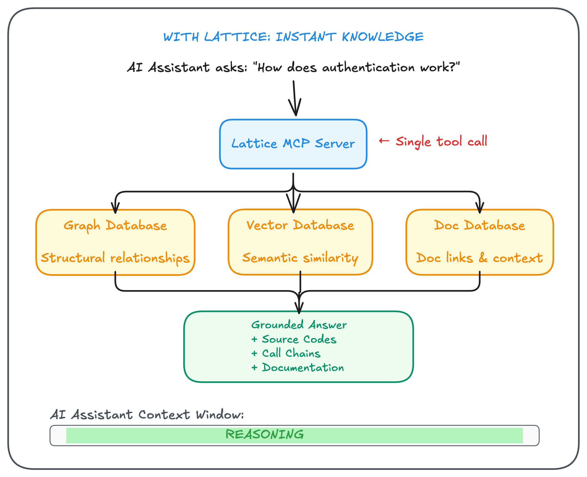
  </picture>
</p>

### The Benefits

| Benefit | Without Lattice | With Lattice |
|---------|-----------------|--------------|
| **Context Conservation** | 70-80% spent on exploration | <5% on Lattice response, 95%+ for reasoning |
| **Response Time** | Multiple file reads (seconds) | Sub-second graph + vector query |
| **Accuracy** | May miss related code | Follows actual call chains and relationships |
| **Consistency** | Depends on which files were read | Same indexed knowledge every time |
| **Structural Queries** | Can't trace "what calls X" reliably | Graph traversal finds all callers instantly |
| **Documentation Awareness** | Must manually find and read docs | Docs are linked to code entities automatically |

### Guiding Agents in the Right Direction

Large codebases often have multiple implementations of similar concepts. An AI assistant exploring on-demand might find the wrong one:

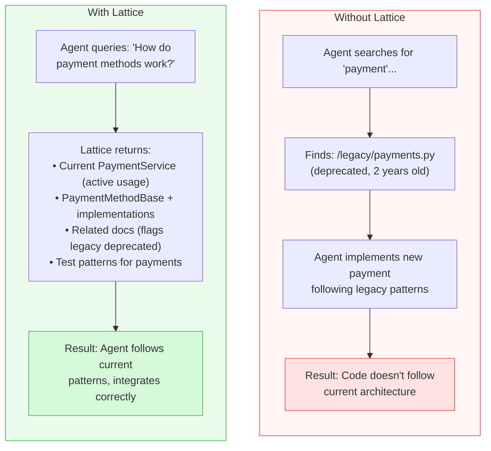

Lattice's graph structure reveals what's **actively used** (high centrality, many callers) versus what's **abandoned** (low centrality, no recent callers). The documentation linking surfaces relevant guides and flags stale information through drift detection.

### Different from AI Assistants, Complementary to Them

Lattice is **not** an AI coding assistant—it's infrastructure that makes AI assistants dramatically more effective:

| Tool | What It Does | How Lattice Helps |
|------|--------------|-------------------|
| **[Claude Code](https://claude.com/claude-code)** | AI pair programming in terminal | Query via MCP instead of repeated file reads |
| **[Gemini CLI](https://github.com/google-gemini/gemini-cli)** | Google's AI agent for terminal | Provides pre-indexed codebase knowledge |
| **[Codex](https://openai.com/index/introducing-codex/)** | OpenAI's coding agent | Reduces context window consumption |
| **[Cursor](https://cursor.com)** | AI-native code editor | Could integrate via MCP for deeper understanding |
| **[Cody](https://sourcegraph.com/cody)** | Sourcegraph's AI assistant | Complements with structural graph queries |

The key insight: these tools are great at **reasoning and generating code**, but they're limited by **context window constraints** and **lack of structural understanding**. Lattice provides the **persistent, structural knowledge layer** they need to work effectively in large codebases.

---

## How It Works

### The Indexing Pipeline

When you run `lattice index`, the system processes your codebase through six stages to build a queryable knowledge base:

<p align="center">
  <picture>
    <source media="(prefers-color-scheme: dark)" srcset="assets/diagrams/indexing-pipeline-dark.png">
    <source media="(prefers-color-scheme: light)" srcset="assets/diagrams/indexing-pipeline-light.png">
    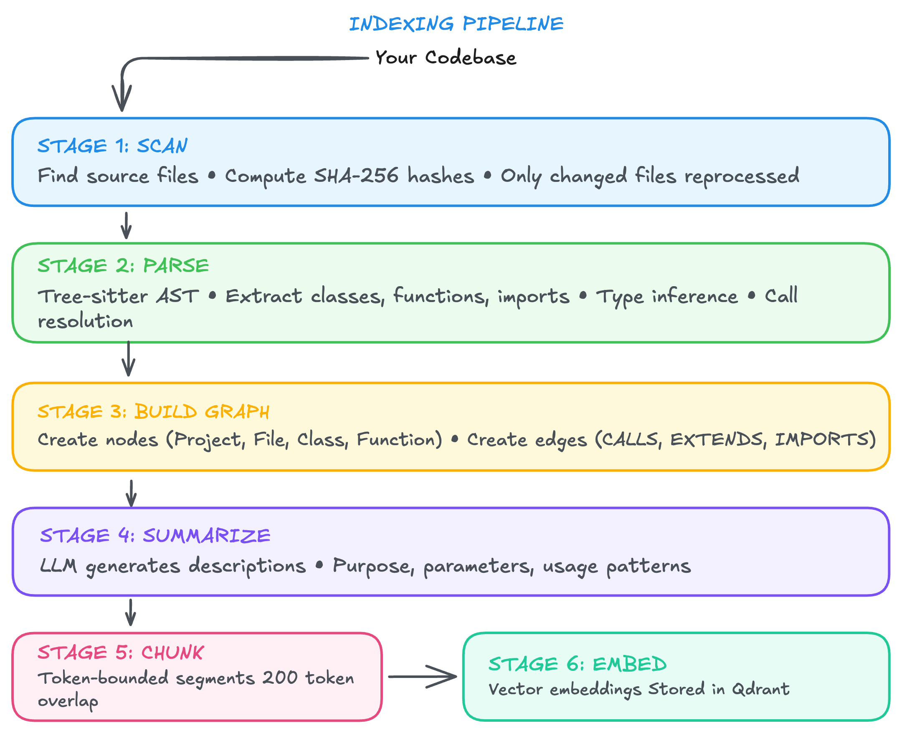
  </picture>
</p>

**Why Tree-sitter?** [Tree-sitter](https://github.com/tree-sitter/tree-sitter) is an incremental parsing library used by editors like VS Code, Neovim, and GitHub. It produces concrete syntax trees that are:

-   **Fast**: Parses thousands of lines per millisecond
-   **Incremental**: Re-parses only changed portions on file updates
-   **Error-tolerant**: Produces useful ASTs even for syntactically incomplete code
-   **Multi-language**: Supports 40+ languages with community-maintained grammars

### The Query Pipeline

When you ask a question, Lattice orchestrates multiple search strategies in parallel:

<p align="center">
  <picture>
    <source media="(prefers-color-scheme: dark)" srcset="assets/diagrams/query-pipeline-dark.png">
    <source media="(prefers-color-scheme: light)" srcset="assets/diagrams/query-pipeline-light.png">
    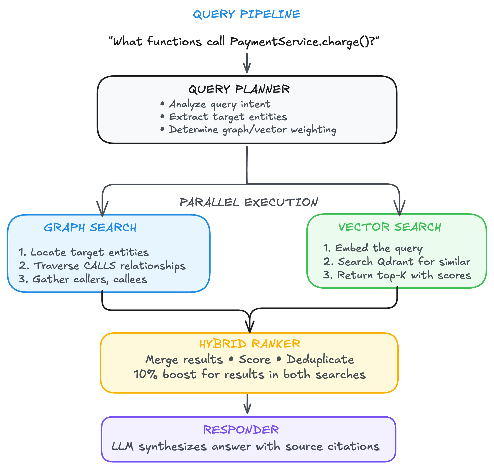
  </picture>
</p>

**Query Types**: The planner recognizes 17 different query intents, each with optimized handling:

| Intent                 | Example Query                      | Primary Strategy                |
| ---------------------- | ---------------------------------- | ------------------------------- |
| Find callers           | "What calls this function?"        | Graph traversal (CALLS edges)   |
| Find callees           | "What does this function call?"    | Graph traversal (CALLS edges)   |
| Trace call chain       | "How does data flow from A to B?"  | Graph pathfinding               |
| Class hierarchy        | "What inherits from BaseHandler?"  | Graph traversal (EXTENDS edges) |
| Explain implementation | "How does caching work?"           | Balanced graph + vector         |
| Semantic search        | "Find error handling code"         | Vector-heavy ranking            |
| Locate entity          | "Where is the User class defined?" | Graph lookup + vector fallback  |

### Hybrid Ranking

Combining graph and vector search requires careful result fusion. Lattice uses an approach inspired by [Reciprocal Rank Fusion (RRF)](https://learn.microsoft.com/en-us/azure/search/hybrid-search-ranking), adapted for the code domain:

```mermaid
flowchart TB
    subgraph inputs["Input Results"]
        direction LR
        graph["Graph Results<br/>1. PaymentService.charge (primary)<br/>2. OrderHandler.submit (depth 1)<br/>3. CheckoutFlow.process (depth 2)<br/>4. PaymentValidator.check (callee)"]
        vector["Vector Results<br/>1. PaymentProcessor.run (0.92)<br/>2. PaymentService.charge (0.89)<br/>3. StripeGateway.execute (0.85)<br/>4. OrderHandler.submit (0.81)"]
    end

    subgraph scoring["Scoring Signals"]
        direction LR
        gs["Graph Signals<br/>• Relationship weight<br/>• Distance decay<br/>• Centrality"]
        vs["Vector Signals<br/>• Cosine similarity<br/>• Code quality<br/>• Entity type boost"]
    end

    subgraph output["Merged Results"]
        merged["1. PaymentService.charge (0.95) - Hybrid boost<br/>2. OrderHandler.submit (0.87) - Hybrid boost<br/>3. PaymentProcessor.run (0.82)<br/>4. CheckoutFlow.process (0.78)<br/>5. StripeGateway.execute (0.71)"]
    end

    inputs --> scoring --> output

    style graph fill:#e7f5ff,stroke:#228be6
    style vector fill:#ebfbee,stroke:#40c057
    style gs fill:#e7f5ff,stroke:#228be6
    style vs fill:#ebfbee,stroke:#40c057
    style merged fill:#f3f0ff,stroke:#7950f2
```

**Adaptive Weighting** adjusts based on query intent:

| Intent           | Graph Weight | Vector Weight |
| ---------------- | ------------ | ------------- |
| Find callers     | 0.80         | 0.20          |
| Find hierarchy   | 0.85         | 0.15          |
| Explain impl.    | 0.50         | 0.50          |
| Semantic search  | 0.25         | 0.75          |
| Find similar     | 0.20         | 0.80          |

This adaptive approach ensures structural queries ("What calls X?") leverage the graph's precision, while exploratory queries ("Find code related to payments") leverage vectors' semantic flexibility.

### Multi-Hop Graph Reasoning

One of Lattice's most powerful capabilities is **multi-hop graph reasoning**—the ability to traverse multiple relationship edges to answer complex questions that span several layers of code architecture.

#### What is Multi-Hop Reasoning?

Traditional code search finds direct matches. Multi-hop reasoning follows chains of relationships:

<p align="center">
  <picture>
    <source media="(prefers-color-scheme: dark)" srcset="assets/diagrams/multi-hop-dark.png">
    <source media="(prefers-color-scheme: light)" srcset="assets/diagrams/multi-hop-light.png">
    
  </picture>
</p>

#### Supported Multi-Hop Queries

| Query Type | What It Traverses | Example |
|------------|-------------------|---------|
| **Transitive Callers** | All functions that eventually call target | "What code paths lead to `PaymentService.charge()`?" |
| **Transitive Callees** | All functions eventually called by source | "What does the `APIController` ultimately invoke?" |
| **Call Chains** | Shortest paths between two entities | "How does data flow from `UserInput` to `Database`?" |
| **Inheritance Hierarchies** | Class ancestry up and down | "Show the full class hierarchy of `BaseHandler`" |
| **Dependency Graphs** | Import chains across modules | "What modules depend on the `auth` package?" |

#### Depth-Aware Scoring

Results from multi-hop queries are scored based on their distance from the query target. Closer relationships are weighted higher:

```
Depth 1 (direct):     score = 1.0
Depth 2 (1 hop away): score = 0.8
Depth 3 (2 hops):     score = 0.6
Depth 4 (3 hops):     score = 0.4
Depth 5 (4 hops):     score = 0.3 (minimum)
```

This ensures that direct callers/callees appear first, while still surfacing the complete chain for comprehensive understanding.

#### Example: Tracing Authentication Flow

```bash
lattice query "Trace how login requests are processed" --verbose
```

**Output:**

```
Answer: Login requests flow through 4 layers:

1. APIController.handleLogin() receives the HTTP request
2. AuthMiddleware.authenticate() validates the session token
3. AuthService.validateCredentials() checks username/password against the database
4. SessionManager.createSession() generates a new session token

The complete call chain:
  APIController.handleLogin()
    └── AuthMiddleware.authenticate()
          └── AuthService.validateCredentials()
                ├── PasswordHasher.verify()
                └── UserRepository.findByEmail()
          └── SessionManager.createSession()
                └── TokenGenerator.generate()

Sources:
  • src/api/controller.py:45 (APIController.handleLogin)
  • src/middleware/auth.py:23 (AuthMiddleware.authenticate)
  • src/services/auth.py:67 (AuthService.validateCredentials)
  • src/services/session.py:12 (SessionManager.createSession)

Reasoning depth: Multi-hop analysis (up to 5 hops)
```

Multi-hop reasoning transforms Lattice from a simple code search tool into a **code understanding system** that can answer architectural questions about how components interact across your entire codebase.

---

## Features

### Structural Code Understanding

Lattice builds a property graph that captures the architecture of your codebase:

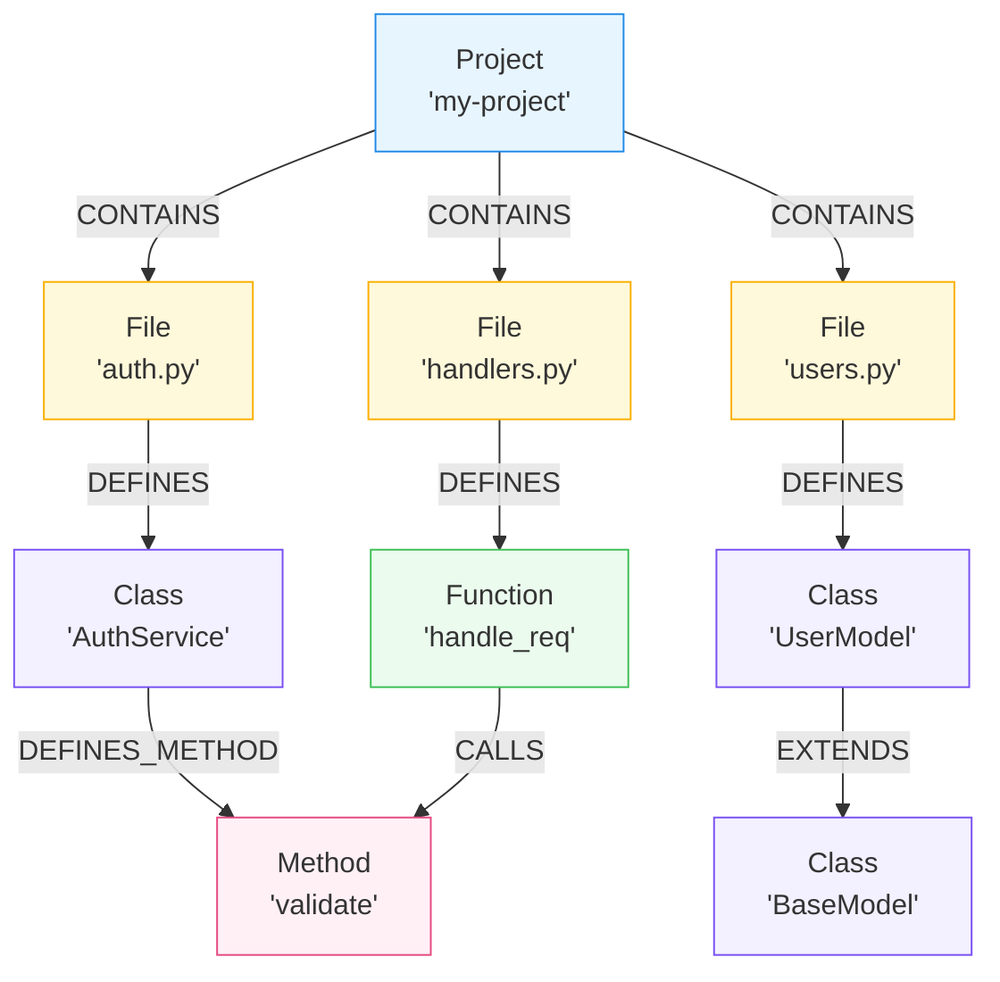

**What relationships are captured:**

| Relationship     | Meaning                         | Use Case                      |
| ---------------- | ------------------------------- | ----------------------------- |
| `CONTAINS`       | Project contains files          | Scope queries to a project    |
| `DEFINES`        | File defines class/function     | Find where code is defined    |
| `DEFINES_METHOD` | Class defines method            | Navigate class structure      |
| `EXTENDS`        | Class inherits from parent      | Trace inheritance hierarchies |
| `CALLS`          | Function/method invokes another | Find all callers/callees      |
| `IMPORTS`        | File imports module             | Trace dependencies            |

**Advanced call resolution**: Lattice doesn't just track direct calls—it resolves:

-   Method chains (`user.profile.save()`)
-   Super calls with inheritance traversal
-   Import aliases and re-exports
-   IIFE patterns in JavaScript
-   Built-in detection (won't create spurious edges for `print()`, `console.log()`, etc.)

This is powered by a type inference engine that tracks variable assignments and infers types from context, enabling accurate call graph construction even in dynamically-typed languages.

### Documentation Intelligence

**Documentation is a first-class citizen in Lattice.** While code tells you *what* the system does, documentation tells you *why* and *how to use it*. Lattice bridges these two knowledge sources, enabling queries that draw from both simultaneously.

#### Why Documentation Matters for Code Intelligence

Most code search tools ignore documentation entirely. This creates problems:

1. **Lost Context**: Code comments and READMEs often contain crucial design decisions, edge cases, and usage examples that don't appear in the code itself.

2. **Stale Documentation**: Documentation frequently drifts out of sync with code. Without detection, AI assistants may provide advice based on outdated docs.

3. **Fragmented Knowledge**: The answer to "How do I use X?" might require synthesizing information from code, API docs, and internal guides.

Lattice solves these by treating documentation as queryable, linked data:

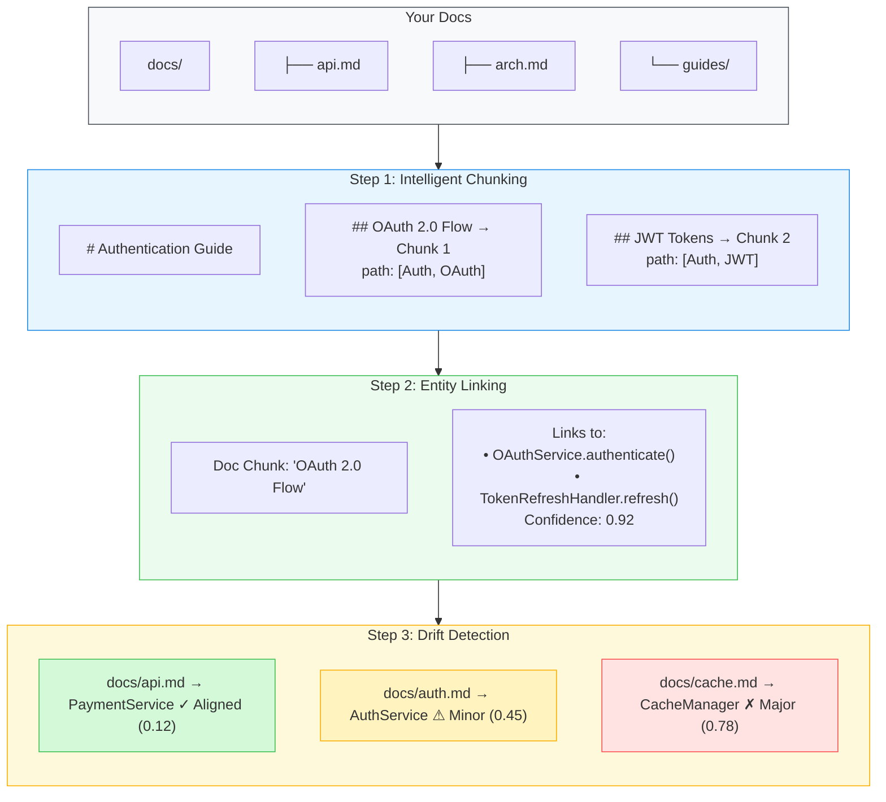

#### What You Can Do With Documentation Intelligence

**Query code and docs together:**
```bash
# This searches both code AND documentation, returning grounded answers
lattice query "How do I implement a new payment method?"
# Returns: Code examples + API documentation + integration guides
```

**Check for stale documentation:**
```bash
lattice docs drift --project my-project

# Output:
# ┌─────────────────────────────────────────────────────────────────┐
# │ Document           │ Entity           │ Status      │ Score   │
# ├─────────────────────────────────────────────────────────────────┤
# │ docs/api.md        │ PaymentService   │ ✓ Aligned   │ 0.12    │
# │ docs/auth.md       │ AuthService      │ ⚠ Minor     │ 0.45    │
# │ docs/cache.md      │ CacheManager     │ ✗ Major     │ 0.78    │
# └─────────────────────────────────────────────────────────────────┘
```

**See what code a document describes:**
```bash
lattice docs links --document docs/api.md --project my-project

# Shows all code entities linked to this doc with confidence scores
```

**Find documentation for specific code:**
```bash
lattice docs links --entity AuthService --project my-project

# Shows all documentation that references this code entity
```

#### CLI Commands for Documentation

```bash
# Index documentation alongside code
lattice docs index ./docs --project my-project

# Force re-index all documents
lattice docs index ./docs --project my-project --force

# Check which docs have drifted from code
lattice docs drift --project my-project

# Check drift for specific document
lattice docs drift --project my-project --document docs/api.md

# Check drift for specific code entity
lattice docs drift --project my-project --entity PaymentService

# List all indexed documents
lattice docs list --project my-project

# List only drifted documents
lattice docs list --project my-project --drifted

# Show document details with chunk breakdown
lattice docs show docs/api.md --project my-project --chunks

# View document-to-code links
lattice docs links --project my-project
```

### Multi-Project Support

Lattice isolates each indexed codebase as a separate project. This enables:

-   **Cross-project queries**: Search across all projects or scope to one
-   **Independent lifecycles**: Re-index one project without affecting others
-   **Team workflows**: Different teams index their own services

```bash
# Index multiple projects
lattice index ./auth-service --name auth
lattice index ./payment-service --name payments
lattice index ./api-gateway --name gateway

# Query specific project
lattice query "How does token refresh work?" --project auth

# Query across all projects
lattice query "Where is PaymentIntent created?"

# Manage projects
lattice projects list
lattice projects show auth
lattice projects delete old-project --yes
```

### MCP Integration

[Model Context Protocol (MCP)](https://www.anthropic.com/news/model-context-protocol) is an open standard from Anthropic for connecting AI assistants to external tools. Lattice includes an MCP server that exposes its capabilities to Claude Code, Claude Desktop, and other MCP-compatible clients.

**What is MCP?** Think of MCP as a "USB-C for AI"—a standardized way for AI models to interact with external tools and data sources. Instead of building custom integrations for each AI assistant, you implement MCP once and any compatible client can use your tool.

**Available Tools:**

| Tool               | Description                                   | Example Use                                       |
| ------------------ | --------------------------------------------- | ------------------------------------------------- |
| `index_repository` | Index a codebase into the knowledge graph     | "Index this repo so I can ask questions about it" |
| `query_code_graph` | Natural language questions with hybrid search | "How does the authentication flow work?"          |
| `get_code_snippet` | Retrieve source code by fully qualified name  | "Show me the code for PaymentService.charge"      |
| `semantic_search`  | Find code by functionality or intent          | "Find all error handling code"                    |

**Setup with Claude Code:**

```bash
# Add Lattice as an MCP server
claude mcp add lattice -- uv run lattice mcp-server

# Or with a specific target repository
claude mcp add lattice \
  --env TARGET_REPO_PATH=/path/to/project \
  -- uv run lattice mcp-server
```

Once configured, Claude Code can automatically use Lattice to answer questions about your codebase, find relevant code, and trace through call chains—all without you explicitly invoking commands.

**How It Helps AI Assistants:**

When Claude Code (or any MCP-compatible assistant) needs to understand your codebase, it can call Lattice instead of reading files one by one:

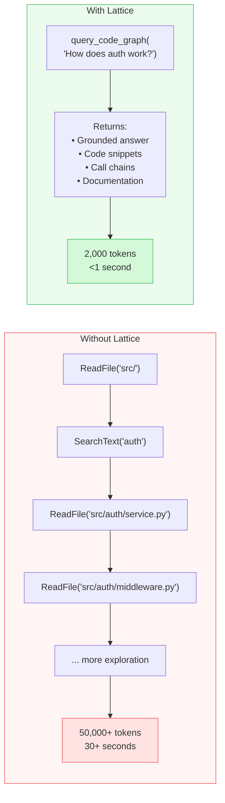

---

## Quick Start

### Prerequisites

-   **Python 3.11+**: Required runtime
-   **Docker**: For running Memgraph, Qdrant, and PostgreSQL
-   **LLM API Key**: One of:
    -   [OpenAI API key](https://platform.openai.com/api-keys) (default, recommended)
    -   [Anthropic API key](https://console.anthropic.com/settings/keys) (Claude)
    -   [Google AI API key](https://aistudio.google.com/app/apikey) (Gemini)
    -   [Ollama](https://ollama.ai) installed locally (free, no API key)

### Step 1: Install Lattice

```bash
git clone https://github.com/your-org/lattice.git
cd lattice

# Install with uv (recommended)
uv pip install -e .

# Or with pip
pip install -e .
```

### Step 2: Configure Environment

```bash
cp .env.example .env
```

Edit `.env` with your API key:

```env
# Option 1: OpenAI (default, easiest)
OPENAI_API_KEY=sk-...

# Option 2: Anthropic Claude
ANTHROPIC_API_KEY=sk-ant-...
LLM_PROVIDER=anthropic
EMBEDDING_PROVIDER=openai  # Claude doesn't provide embeddings

# Option 3: Google Gemini
GOOGLE_API_KEY=...
LLM_PROVIDER=google
EMBEDDING_PROVIDER=google

# Option 4: Ollama (local, free)
LLM_PROVIDER=ollama
EMBEDDING_PROVIDER=ollama
# Make sure Ollama is running: ollama serve
# Pull a model: ollama pull llama3.2
```

### Step 3: Start Infrastructure

```bash
docker-compose up -d
```

This starts three services:

| Service                                                      | Port | Purpose                              |
| ------------------------------------------------------------ | ---- | ------------------------------------ |
| [Memgraph](https://github.com/memgraph/memgraph)             | 7687 | Graph database for code structure    |
| [Memgraph Lab](https://memgraph.com/docs/data-visualization) | 3000 | Visual graph explorer (optional)     |
| [Qdrant](https://qdrant.tech)                                | 6333 | Vector database for semantic search  |
| PostgreSQL                                                   | 5432 | Document metadata and drift tracking |

Verify everything is running:

```bash
docker ps
# Should show: memgraph, memgraph-lab, qdrant, postgres
```

### Step 4: Index Your First Project

```bash
lattice index /path/to/your/codebase --name my-project
```

You'll see progress through each stage:

```
Scanning files...                    ████████████████████ 100%
Parsing AST...                       ████████████████████ 100%
Building graph...                    ████████████████████ 100%
Generating summaries...              ████████████████████ 100%
Creating embeddings...               ████████████████████ 100%

✓ Indexed my-project
  Files: 247
  Entities: 1,832
  Graph nodes: 2,156
  Chunks embedded: 3,891
  Time: 2m 34s
```

### Step 5: Start Querying

```bash
# Ask a question
lattice query "How does user authentication work?"

# Search for code semantically
lattice search "database connection pooling"

# Get detailed reasoning
lattice query "What calls the PaymentService?" --verbose

# Check system status
lattice status
```

---

## CLI Reference

### Core Commands

| Command                      | Description                     |
| ---------------------------- | ------------------------------- |
| `lattice index <path>`       | Index a codebase                |
| `lattice query "<question>"` | Ask a natural language question |
| `lattice search "<query>"`   | Semantic code search            |
| `lattice status`             | Show database statistics        |
| `lattice settings`           | Show current configuration      |

**Index options:**

```bash
lattice index <path> \
  --name <project-name>    # Custom name (default: directory name)
  --force                  # Re-index all files, ignore cache
  --skip-metadata          # Skip AI metadata generation (faster)
```

**Query options:**

```bash
lattice query "<question>" \
  --project <name>         # Scope to specific project
  --limit <n>              # Max results (default: 15)
  --verbose                # Show reasoning and execution stats
```

### Project Management

```bash
# List all indexed projects with stats
lattice projects list

# Show detailed info for a project
lattice projects show <name>

# Delete a project and all its data
lattice projects delete <name> [--yes]
```

### Documentation

```bash
# Index markdown documentation
lattice docs index <path> --project <name> [--force]

# Check for documentation drift
lattice docs drift --project <name> [--document <path>] [--entity <name>]

# List indexed documents
lattice docs list --project <name> [--drifted] [--json]

# Show document details and chunks
lattice docs show <path> --project <name> [--chunks]

# View document-to-code links
lattice docs links --project <name> [--document <path>] [--entity <name>]
```

### Metadata

Lattice generates AI-powered project metadata including architecture diagrams, tech stack analysis, and feature documentation.

```bash
# View all metadata
lattice metadata show <name>

# View specific field
lattice metadata show <name> --field <field>
# Fields: overview, architecture, tech, features, deps, entry, folders

# Output as JSON
lattice metadata show <name> --json

# Regenerate metadata
lattice metadata regenerate <name> [--field <field>]
```

---

## Technology Stack

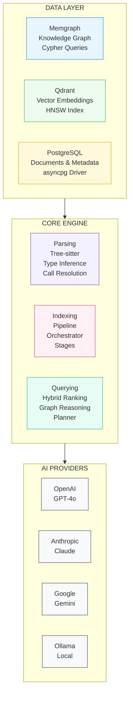

### Database Details

| Component           | Technology                                       | Why We Chose It                                                                            |
| ------------------- | ------------------------------------------------ | ------------------------------------------------------------------------------------------ |
| **Graph Database**  | [Memgraph](https://github.com/memgraph/memgraph) | In-memory graph DB with Cypher support, sub-millisecond traversals, MAGE algorithm library |
| **Vector Database** | [Qdrant](https://github.com/qdrant/qdrant)       | Rust-based, high-performance HNSW indexing, rich filtering, excellent Python SDK           |
| **Metadata Store**  | PostgreSQL                                       | Reliable, async driver (asyncpg), good for structured document metadata                    |

### Parsing

| Component          | Technology                                                | Purpose                                                     |
| ------------------ | --------------------------------------------------------- | ----------------------------------------------------------- |
| **AST Parser**     | [Tree-sitter](https://github.com/tree-sitter/tree-sitter) | Fast, incremental, error-tolerant parsing for 40+ languages |
| **Python Grammar** | tree-sitter-python                                        | Extract classes, functions, decorators, type hints          |
| **JS/TS Grammar**  | tree-sitter-javascript, tree-sitter-typescript            | Extract classes, functions, JSX, interfaces, type aliases   |

### Supported Languages

| Language   | Extensions                    | Features Extracted                                                    |
| ---------- | ----------------------------- | --------------------------------------------------------------------- |
| Python     | `.py`                         | Classes, functions, methods, decorators, type annotations, docstrings |
| JavaScript | `.js`, `.jsx`, `.mjs`, `.cjs` | Classes, functions, arrow functions, methods, JSX components          |
| TypeScript | `.ts`, `.tsx`, `.mts`, `.cts` | Classes, functions, interfaces, type aliases, generics                |

### LLM Providers

| Provider      | LLM Models                               | Embedding Models                                               | Notes                 |
| ------------- | ---------------------------------------- | -------------------------------------------------------------- | --------------------- |
| **OpenAI**    | GPT-4o, GPT-4, GPT-3.5                   | text-embedding-3-small (1536d), text-embedding-3-large (3072d) | Default, best quality |
| **Anthropic** | Claude Sonnet, Claude Opus, Claude Haiku | _(none—use another provider)_                                  | Great for analysis    |
| **Google**    | Gemini 1.5 Flash/Pro, Gemini 2.0         | text-embedding-004 (768d)                                      | Good alternative      |
| **Ollama**    | Llama 3.2, CodeLlama, Mistral, DeepSeek  | nomic-embed-text, mxbai-embed-large                            | Free, local, private  |

---

## Status & Roadmap

> **Work in Progress**: Lattice is under active development and not yet production-ready. APIs may change. We welcome feedback and contributions.

### What Works Today

-   Index Python, TypeScript, and JavaScript codebases
-   Hybrid graph+vector querying with natural language
-   Documentation indexing with drift detection
-   Multi-project support with isolation
-   MCP server for Claude Code integration
-   Incremental indexing (only changed files reprocessed)
-   Multiple LLM/embedding provider options

### Roadmap

| Feature | Description | Status |
|---------|-------------|--------|
| **Agentic Drift Detection** | Replace LLM-based drift scoring with autonomous agents that deeply analyze code behavior vs documentation claims | Planned |
| **Parallel Doc+Code Queries** | Query documentation and codebase simultaneously for more robust, grounded answers that cite both code and docs | Planned |
| **Documentation Edit Suggestions** | When drift is detected, generate specific edit suggestions to bring docs back in sync with code | Planned |
| **Git Integration** | Leverage commit history, blame data, and PR context for richer answers. Understand when code changed and why. | Planned |
| **External Docs** | Index documentation from Notion, Confluence, Google Docs, and other hosted sources alongside local docs | Planned |
| **More Languages** | Go, Rust, Java, C/C++, Ruby, PHP parser support using tree-sitter grammars | Planned |
| **Agentic Code Analysis** | Autonomous code review, security scanning, and quality alerts. Trigger warnings when patterns indicate issues. | Planned |
| **Hosted Version** | Managed Lattice service—no infrastructure to run. Index public repos, connect private via GitHub App. | Planned |
| **IDE Plugins** | VS Code, JetBrains, Neovim integrations for in-editor querying without leaving your workflow | Exploring |
| **Real-time Indexing** | Watch for file changes and update the index incrementally without manual re-indexing | Exploring |

---

### Deep Dive: Agentic Drift Detection

Our current drift detection works by sending documentation chunks and their linked code entities to an LLM, asking it to assess alignment. While this catches obvious discrepancies, it has fundamental limitations:

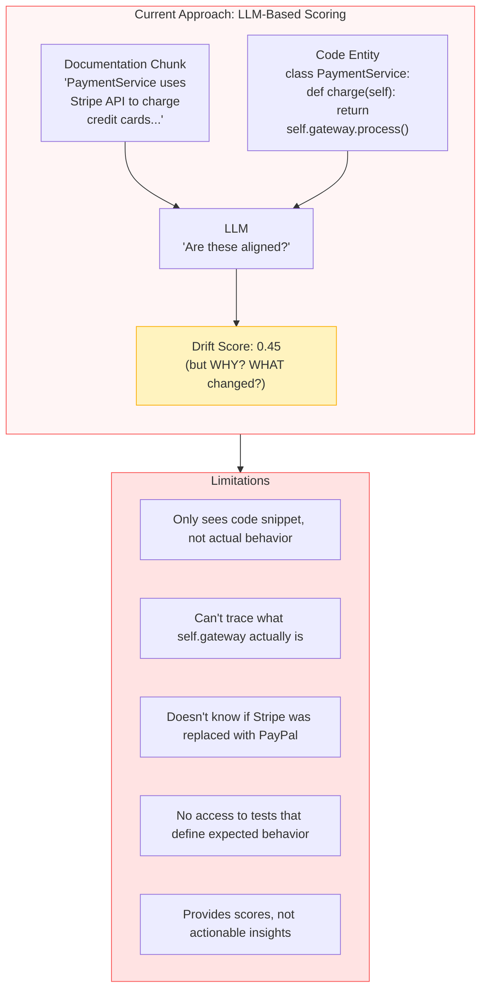

#### The Agentic Approach

Instead of asking an LLM to score alignment from limited context, we deploy an **autonomous agent** that investigates drift like a developer would—using tools to explore, trace, and verify:

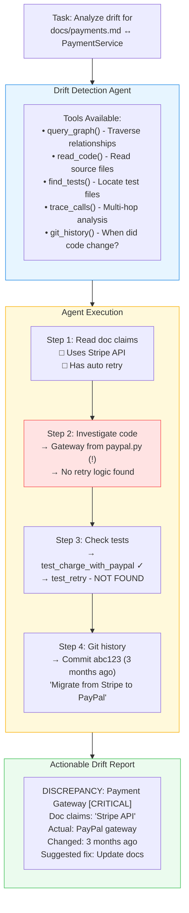

Here's an example of what agentic drift detection output looks like:

<p align="center">
  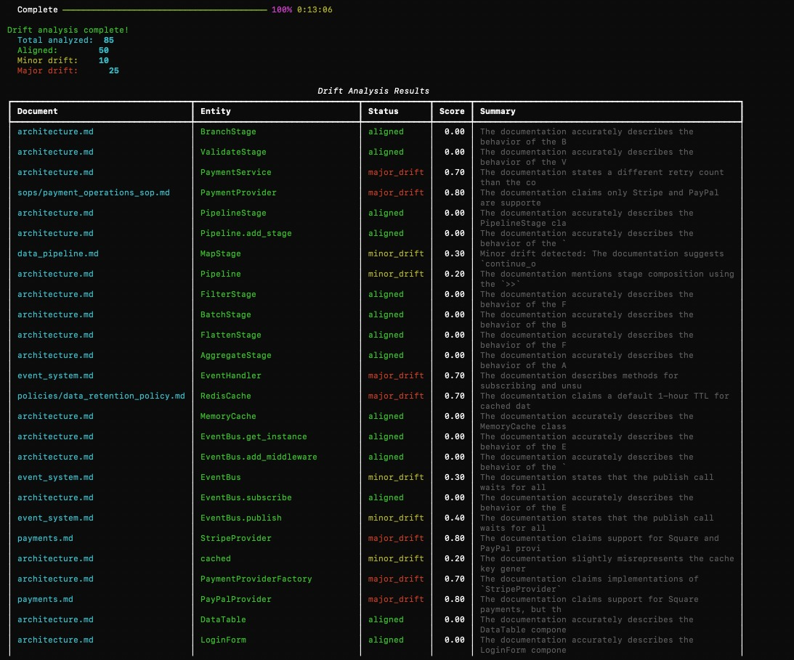
</p>

#### Why Agentic is Better

| Aspect | LLM Scoring | Agentic Analysis |
|--------|-------------|------------------|
| **Depth of Analysis** | Surface-level text comparison | Deep behavioral investigation |
| **Accuracy** | May miss indirect relationships | Traces actual code paths |
| **Context** | Limited to provided snippets | Full codebase access via tools |
| **Actionability** | Just a score (0.45) | Specific fixes with diffs |
| **Historical Context** | None | Git history shows when/why drift occurred |
| **Impact Assessment** | None | Graph centrality shows criticality |
| **Related Drift** | Checks one doc at a time | Finds all affected documentation |
| **Verification** | Can't verify claims | Cross-references with tests |

This agentic approach transforms drift detection from a passive scoring system into an active investigation system that understands code behavior, not just code text.

---

## Development

### Setup

```bash
# Install with dev dependencies
uv pip install -e ".[dev]"
```

### Running Tests

```bash
# All tests
pytest

# Specific file
pytest tests/test_parsing.py

# Specific test with verbose output
pytest tests/test_parsing.py::test_function_name -v

# With coverage
pytest --cov=lattice
```

### Code Quality

```bash
# Type checking
mypy src/lattice

# Linting
ruff check src/lattice

# Format code
ruff format src/lattice
```

### Infrastructure for Development

```bash
# Start all services
docker-compose up -d

# View logs
docker-compose logs -f memgraph

# Stop services
docker-compose down

# Reset all data
docker-compose down -v
```

---

## Contributing

We welcome contributions! Whether it's:

-   Bug reports and feature requests (open an issue)
-   Documentation improvements
-   New language parser support
-   Performance optimizations
-   Test coverage improvements

Please open an issue first to discuss significant changes.

---

## License

MIT

---

<p align="center">
  Built with <a href="https://memgraph.com">Memgraph</a>, <a href="https://qdrant.tech">Qdrant</a>, and <a href="https://github.com/tree-sitter/tree-sitter">Tree-sitter</a>
</p>
